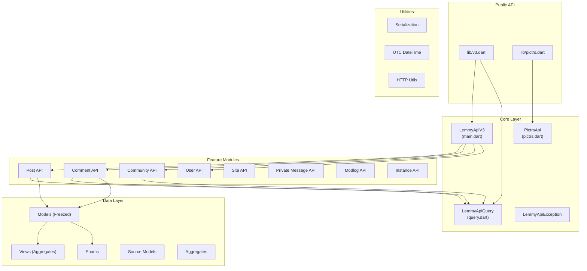
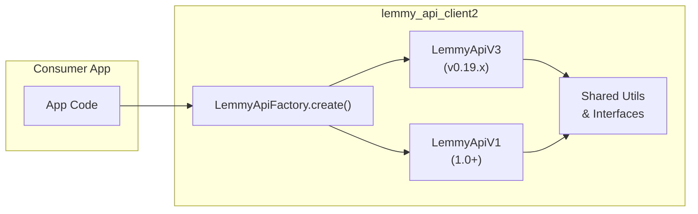

# Lemmy API Client Architecture

A comprehensive architecture overview of the `lemmy_api_client2` Dart package.

## Overview

This client provides a statically-typed, Future-based interface for the [Lemmy API](https://join-lemmy.org/api/). It supports both web and native environments.



---

## Directory Structure

```
lib/
├── v3.dart                    # Main export for Lemmy API v3
├── pictrs.dart                # Export for Pictrs image API
└── src/
    ├── exceptions.dart        # LemmyApiException definition
    ├── pictrs.dart            # PictrsApi implementation + models
    ├── utils/
    │   ├── serde.dart         # JSON serialization annotations
    │   ├── force_utc_datetime.dart
    │   └── response_ok.dart   # HTTP response extension
    └── v3/
        ├── main.dart          # LemmyApiV3 client class
        ├── query.dart         # LemmyApiQuery abstract class
        ├── api/               # API endpoint definitions
        │   ├── api.dart       # Barrel export
        │   ├── post.dart
        │   ├── comment/
        │   ├── community.dart
        │   ├── user/
        │   ├── site.dart
        │   ├── modlog.dart
        │   ├── instance.dart
        │   └── private_message/
        ├── enums/             # API enum types
        │   ├── enums.dart
        │   ├── sort_type.dart
        │   ├── listing_type.dart
        │   └── ...
        ├── models/            # Data models (Freezed)
        │   ├── models.dart
        │   ├── source.dart    # Core entity models
        │   ├── views.dart     # Aggregate view models
        │   ├── aggregates.dart
        │   └── [feature]/     # Feature-specific models
        └── views/             # Additional view types
```

---

## Core Components

### 1. LemmyApiV3 Client

The main API client in [main.dart](file:///Users/spgb/Documents/lemmy_api_client/lib/src/v3/main.dart).

```dart
class LemmyApiV3 {
  final String host;
  final http.Client _client;     // Injectable HTTP client
  final Duration timeout;         // Request timeout (default: 30s)
  final int maxRetries;          // Retry attempts (default: 3)
  final Duration retryDelay;     // Base backoff delay (default: 500ms)
  
  LemmyApiV3(this.host, {http.Client? client, ...});
  
  Future<T> run<T>(LemmyApiQuery<T> query) async { ... }
  void close();  // Clean up resources
}
```

**Key Features:**
- **HTTP Client Injection** for testability and connection pooling
- **Configurable Timeout** (default: 30 seconds)
- **Automatic Retry** with exponential backoff for transient failures
- Constructs requests based on `HttpMethod` (GET, POST, PUT)
- Handles JWT authentication via `Authorization` header
- Augments all responses with `instance_host` for multi-instance tracking
- Supports localhost development (HTTP vs HTTPS)
- Unified error handling with `LemmyApiException`

### 2. Query Pattern

Defined in [query.dart](file:///Users/spgb/Documents/lemmy_api_client/lib/src/v3/query.dart):

```dart
enum HttpMethod { get, put, post }

abstract class LemmyApiQuery<T> {
  abstract final String path;
  abstract final HttpMethod httpMethod;
  
  Map<String, dynamic> toJson();
  T responseFactory(Map<String, dynamic> json);
}
```

Each API endpoint implements this interface, providing:
- The endpoint path
- HTTP method
- Request serialization (`toJson`)
- Response deserialization (`responseFactory`)

### 3. API Endpoints

Endpoints are organized by feature domain:

| Module | Path | Description |
|--------|------|-------------|
| `post.dart` | `/post/*` | Post CRUD, voting, featuring, reports |
| `comment/` | `/comment/*` | Comments, replies, reports |
| `community.dart` | `/community/*` | Community management, subscriptions |
| `user/` | `/user/*` | User profiles, settings, authentication |
| `site.dart` | `/site/*` | Site configuration, registration |
| `modlog.dart` | `/modlog` | Moderation logs |
| `instance.dart` | `/federated_instances` | Federation info |
| `private_message/` | `/private_message/*` | Direct messages |

**Example Endpoint:**
```dart
@freezed
class GetPost with _$GetPost implements LemmyApiQuery<FullPostView> {
  @apiSerde
  const factory GetPost({
    int? id,
    int? commentId,
    String? auth,
  }) = _GetPost;
  
  const GetPost._();
  factory GetPost.fromJson(Map<String, dynamic> json) => _$GetPostFromJson(json);

  @override String get path => '/post';
  @override HttpMethod get httpMethod => HttpMethod.get;
  @override FullPostView responseFactory(Map<String, dynamic> json) => 
      FullPostView.fromJson(json);
}
```

### 4. Models (Freezed)

All models use [Freezed](https://pub.dev/packages/freezed) for immutability and code generation:

- **Source Models** ([source.dart](file:///Users/spgb/Documents/lemmy_api_client/lib/src/v3/models/source.dart)): Base entity types (`Person`, `Post`, `Comment`, `Community`, etc.)
- **View Models** ([views.dart](file:///Users/spgb/Documents/lemmy_api_client/lib/src/v3/models/views.dart)): Composite types returned by API (`PostView`, `CommentView`)
- **Aggregates** ([aggregates.dart](file:///Users/spgb/Documents/lemmy_api_client/lib/src/v3/models/aggregates.dart)): Count/stats aggregations
- **API Models** ([api.dart](file:///Users/spgb/Documents/lemmy_api_client/lib/src/v3/models/api.dart)): Request/response wrapper types

### 5. PictrsApi

Separate API for image uploads via [pictrs.dart](file:///Users/spgb/Documents/lemmy_api_client/lib/src/pictrs.dart):

```dart
class PictrsApi {
  Future<PictrsUpload> upload({required String filePath, required String auth});
  Future<void> delete(PictrsUploadFile pictrsFile);
}
```

---

## Design Patterns

| Pattern | Usage |
|---------|-------|
| **Command Pattern** | Each endpoint is a serializable query object |
| **Factory Method** | `responseFactory` in each query |
| **Immutable Models** | All models via Freezed |
| **Barrel Exports** | Clean public API surface |
| **Code Generation** | Freezed + json_serializable |

---

## Implemented Features

The following improvements have been implemented in the current codebase:

### ✅ HTTP Client Injection

**Implementation:** `LemmyApiV3` now accepts an optional `http.Client` parameter.

```dart
LemmyApiV3(
  'lemmy.ml',
  client: mySharedClient,  // Optional: inject your own client
);
```

**Benefits:**

| Benefit | Description |
|---------|-------------|
| **Testing** | Inject mock clients for unit tests without network calls |
| **Interceptors** | Add custom logging, metrics, or request modification |
| **Connection Pooling** | Reuse TCP connections across requests |

#### Connection Pooling Deep Dive

When you inject a single `http.Client` instance and reuse it across multiple API calls (or even multiple `LemmyApiV3` instances), you enable **HTTP connection pooling**:

```dart
// Create a shared client for your app
final sharedClient = http.Client();

// Reuse across multiple Lemmy instances
final lemmy1 = LemmyApiV3('lemmy.ml', client: sharedClient);
final lemmy2 = LemmyApiV3('lemmy.world', client: sharedClient);

// Make many requests - connections are reused!
await lemmy1.run(GetPosts());
await lemmy1.run(GetComments());  // Reuses TCP connection
await lemmy2.run(GetSite());       // New connection for different host
```

**Connection Pooling Benefits:**

1. **Reduced Latency** – Eliminates TCP handshake + TLS negotiation for subsequent requests to the same host (saves ~100-300ms per request)
2. **Lower Resource Usage** – Fewer open sockets, reduced memory footprint
3. **Better Performance Under Load** – Particularly important for mobile apps making many API calls
4. **HTTP/2 Multiplexing** – When supported, multiple requests share a single connection

> [!TIP]
> In Flutter apps, create the `http.Client` at app initialization and dispose it on app termination. Pass it to all `LemmyApiV3` instances.

---

### ✅ Code Duplication Removed

The duplicate `run()` and `_runLocalhost()` methods have been consolidated into:
- `_buildUri()` – Handles HTTP vs HTTPS scheme selection
- `_buildHeaders()` – Centralized header construction
- `_makeRequest()` – Single HTTP request method
- `_executeQuery()` – Query execution with timeout

---

### ✅ Retry/Backoff Logic

**Implementation:** Automatic retry with exponential backoff for transient failures.

```dart
LemmyApiV3(
  'lemmy.ml',
  maxRetries: 3,                           // Default: 3 attempts
  retryDelay: Duration(milliseconds: 500), // Default: 500ms base
);
```

**Retry Behavior:**
- **Attempt 1:** Immediate
- **Attempt 2:** Wait 500ms (delay × 2⁰)
- **Attempt 3:** Wait 1000ms (delay × 2¹)
- **Attempt 4:** Wait 2000ms (delay × 2²)

**Retried Errors:**
- `SocketException` – Network unreachable, connection refused
- `TimeoutException` – Request exceeded timeout
- `http.ClientException` – Connection reset, broken pipe

**Non-Retried Errors:**
- HTTP 4xx/5xx responses (these are valid server responses)
- `LemmyApiException` (API-level errors)

---

### 4. Structured Error Handling

**Current Issue:** `LemmyApiException` only contains a string message.

**Recommendation:**
```dart
class LemmyApiException implements Exception {
  final String message;
  final int? statusCode;
  final String? errorCode;    // Lemmy's error enum
  final dynamic originalError;
  
  const LemmyApiException(this.message, {this.statusCode, this.errorCode, this.originalError});
}
```

---

### ✅ Timeout Configuration

**Implementation:** Configurable per-request timeout with 30-second default.

```dart
LemmyApiV3(
  'lemmy.ml',
  timeout: Duration(seconds: 15),  // Custom timeout
);
```

Timeouts trigger a `TimeoutException`, which is automatically retried per the retry configuration.

---

## Suggested Improvements (Not Yet Implemented)

---

### 6. Model Field Documentation

Many Freezed models lack field documentation. Consider adding doc comments for complex fields like `instanceHost`.

---

## Handling a Breaking V1 API While Supporting Legacy v0.19

This is the critical versioning challenge. Below are strategies ordered from **simplest** to **most flexible**.

### Strategy A: Parallel API Modules (Recommended)

Create a completely separate `v1/` module alongside `v3/`, with shared utilities.

```
lib/
├── v3.dart              # Legacy (supports v0.19 servers)
├── v1.dart              # New V1 API
└── src/
    ├── shared/          # Shared utilities, exceptions
    │   ├── exceptions.dart
    │   └── utils/
    ├── v3/              # Existing v0.19 implementation (unchanged)
    └── v1/              # New V1 implementation
        ├── main.dart
        ├── query.dart
        ├── api/
        ├── models/
        └── enums/
```

**Pros:**
- Zero risk of breaking existing consumers
- Clean separation of concerns
- Easy to deprecate v3 later

**Cons:**
- Some model duplication

**Migration Example:**
```dart
// Legacy usage (unchanged)
import 'package:lemmy_api_client2/v3.dart';
final legacyClient = LemmyApiV3('old-server.example');

// New V1 usage
import 'package:lemmy_api_client2/v1.dart';
final v1Client = LemmyApiV1('new-server.example');
```

---

### Strategy B: Version-Aware Client Factory

A single entry point that detects server version and returns the appropriate client.

```dart
// lib/lemmy.dart
abstract class LemmyApi {
  Future<T> run<T>(covariant LemmyApiQuery<T> query);
}

class LemmyApiFactory {
  /// Probes the server and returns the appropriate client.
  static Future<LemmyApi> create(String host) async {
    final version = await _detectServerVersion(host);
    if (version.major >= 1) {
      return LemmyApiV1(host);
    }
    return LemmyApiV3(host);  // v0.19.x
  }
  
  static Future<SemVer> _detectServerVersion(String host) async {
    // Call /nodeinfo or /api/v3/site to get version
  }
}
```

**Pros:**
- Single API surface for consumers
- Automatic version detection

**Cons:**
- Requires startup network call
- Query types may differ between versions

---

### Strategy C: Adapter Pattern for Shared Models

If V1 models are similar to v0.19 but with field changes, use adapters:

```dart
// Shared interface
abstract class PostData {
  int get id;
  String get name;
  String? get body;
}

// V3 implementation (v0.19)
@freezed
class PostV3 with _$PostV3 implements PostData { ... }

// V1 implementation
@freezed  
class PostV1 with _$PostV1 implements PostData { ... }

// Consumer code works with PostData interface
```

---

### Strategy D: Feature Flags / Conditional Endpoints

For minor differences, use runtime checks:

```dart
class LemmyApiV3 {
  final SemVer serverVersion;
  
  Future<PostView> featurePost(int postId, bool featured) async {
    if (serverVersion >= SemVer(1, 0, 0)) {
      return run(FeaturePostV1(postId: postId, featured: featured));
    } else {
      return run(FeaturePost(postId: postId, featureType: PostFeatureType.local, featured: featured));
    }
  }
}
```

**Use sparingly** — quickly becomes unmaintainable.

---

### Recommended Approach



1. **Immediately:** Create `lib/src/v1/` with new API structure (Strategy A)
2. **Add:** `LemmyApiFactory` for automatic detection (Strategy B)
3. **Define:** Shared interfaces for common types (Strategy C)
4. **Deprecate:** Mark `v3.dart` as `@Deprecated` when V1 is stable

---

## Versioning Checklist

- [ ] Create `/lib/src/v1/` directory structure
- [ ] Define shared interfaces for cross-version compatibility
- [ ] Add server version detection utility
- [ ] Create `LemmyApiFactory` with auto-detection
- [ ] Document breaking changes in CHANGELOG
- [ ] Update README with migration guide
- [ ] Add deprecation annotations to v3 exports
- [ ] Consider conditional exports based on server version

---

## Dependencies

| Package | Purpose |
|---------|---------|
| `http` | HTTP client |
| `freezed_annotation` | Immutable model annotations |
| `json_annotation` | JSON serialization annotations |

**Dev Dependencies:**
- `build_runner` - Code generation
- `freezed` - Model code generation
- `json_serializable` - JSON code generation
